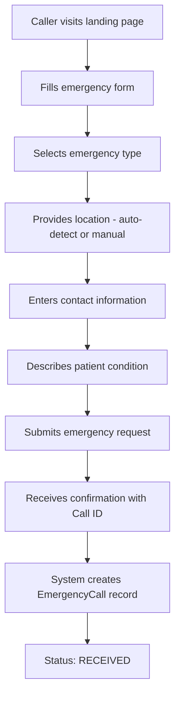
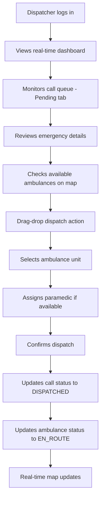
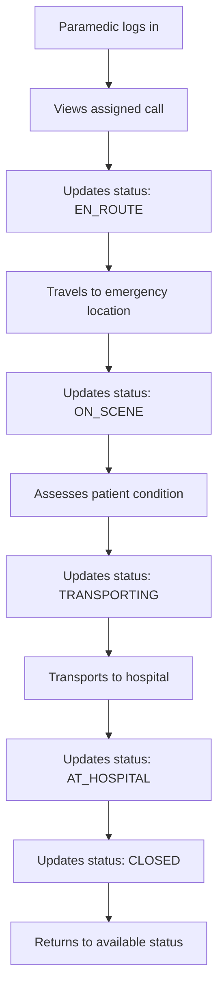
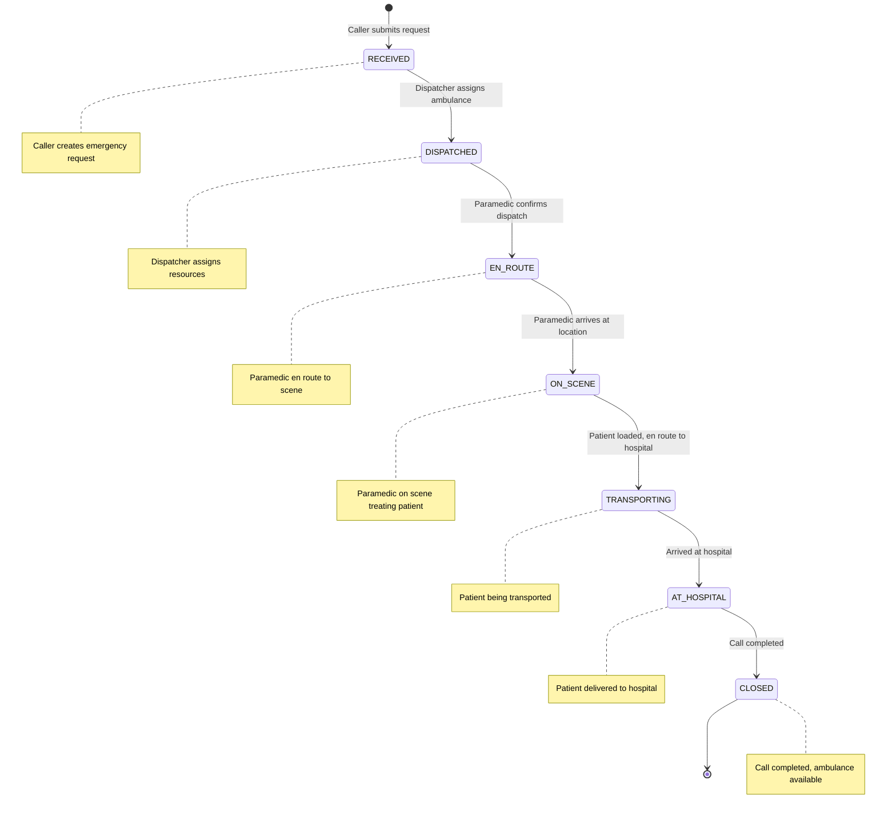
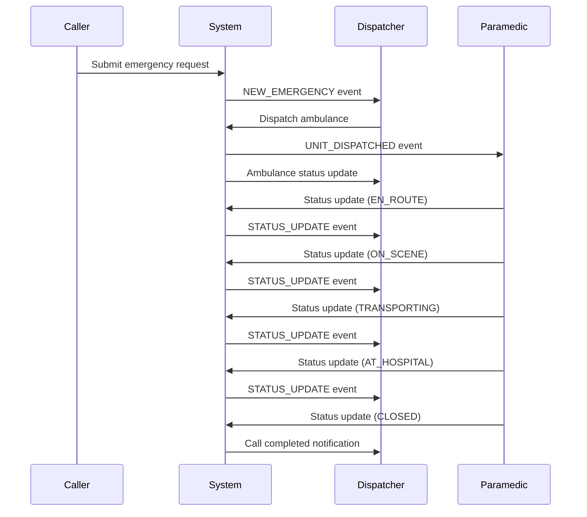

# Emergency Ambulance System - Workflow Design

## System Overview
The Emergency Ambulance System is a web-based dispatch platform that manages emergency calls from initial request through completion. The system supports three primary user types with distinct interfaces and responsibilities.

## User Types & Roles

### 1. **Callers** (Public Users)
- **Access**: Public landing page
- **Purpose**: Request emergency medical assistance
- **Authentication**: None required

### 2. **Dispatchers** (Internal Staff)
- **Access**: Authenticated dashboard
- **Purpose**: Manage emergency calls, dispatch resources, monitor operations
- **Authentication**: Required (dispatcher role)

### 3. **Paramedics** (Field Staff)
- **Access**: Mobile-optimized field interface
- **Purpose**: Update call status, communicate with dispatch
- **Authentication**: Required (paramedic role)

---

## Complete System Workflow

### Phase 1: Emergency Call Initiation

#### Caller Workflow

**Key Actions:**
- Emergency type selection (Cardiac, Trauma, Stroke, etc.)
- Location capture (GPS auto-detect or manual entry)
- Patient information collection
- Detailed incident description

**System Response:**
- Generates unique Call ID
- Creates EmergencyCall record with status "RECEIVED"
- Sends real-time notification to dispatchers

---

### Phase 2: Dispatch Operations

#### Dispatcher Dashboard Workflow

**Dashboard Components:**
- **Left Panel**: Call Queue (Pending/Active/Transporting tabs)
- **Center Panel**: Interactive map with emergency markers and ambulance locations
- **Right Panel**: Resource status (hospitals, fleet overview)

**Key Actions:**
- View pending emergency calls
- Drag ambulance to emergency location for dispatch
- Monitor real-time status updates
- Manage fleet resources

---

### Phase 3: Field Operations

#### Paramedic Field Workflow

**Field Interface Features:**
- Large, mobile-optimized buttons for status updates
- Current call information display
- One-tap status transitions
- Real-time location updates (optional)

---

## Status Flow Diagram

---

## Real-Time Communication Flow

### WebSocket Events

---

## User Interface Workflows

### 1. Caller Interface (Landing Page)
**Purpose**: Emergency request submission
**Key Features**:
- Emergency type selection
- Location auto-detection
- Patient information form
- Real-time form validation
- Confirmation modal with Call ID

### 2. Dispatcher Interface (Dashboard)
**Purpose**: Command and control center
**Key Features**:
- Three-panel layout (Queue/Map/Resources)
- Drag-and-drop dispatch
- Real-time map with markers
- Call filtering and management
- Fleet status monitoring

### 3. Paramedic Interface (Field App)
**Purpose**: Field status updates
**Key Features**:
- Mobile-optimized design
- Large status update buttons
- Current call information
- One-tap status transitions

---

## Data Flow Architecture

### Emergency Call Lifecycle
1. **Creation**: Caller submits form → EmergencyCall record created
2. **Assignment**: Dispatcher assigns ambulance and paramedic
3. **Execution**: Paramedic updates status through field interface
4. **Completion**: Call marked as closed, ambulance returns to available

### Real-Time Updates
- **WebSocket Connection**: Persistent connection for real-time updates
- **Event Broadcasting**: Status changes broadcast to all connected dispatchers
- **Map Updates**: Location and status changes reflected on live map
- **Queue Management**: Call queue updates based on status changes

---

## Security & Access Control

### Authentication Levels
- **Public**: Landing page access only
- **Authenticated Users**: Role-based access control
- **Dispatchers**: Full dashboard access, dispatch capabilities
- **Paramedics**: Field interface access, assigned calls only

### Data Validation
- **Form Validation**: Client-side and server-side validation
- **Status Transitions**: Enforced business rules for status changes
- **Location Updates**: Coordinate validation and sanitization

---

## Error Handling & Recovery

### System Resilience
- **WebSocket Reconnection**: Automatic reconnection on connection loss
- **Form Recovery**: Browser storage for form data recovery
- **Status Synchronization**: Periodic status sync to prevent drift
- **Offline Capability**: Basic functionality when connection is lost

### User Feedback
- **Toast Notifications**: Real-time feedback for all actions
- **Loading States**: Visual feedback during operations
- **Error Messages**: Clear, actionable error messages
- **Success Confirmations**: Confirmation for critical actions

---

## Ambulance Lifecycle and Operations

### Fleet Entities
- **Model**: `dispatch.Ambulance`
- **Key Fields**: `unit_number`, `unit_type`, `status`, `current_latitude`, `current_longitude`, `assigned_paramedic`, `current_emergency`
- **Status Values**: `AVAILABLE`, `EN_ROUTE`, `ON_SCENE`, `TRANSPORTING`, `MAINTENANCE`, `OUT_OF_SERVICE`

### Lifecycle
1. **Available**: Idle and ready for assignment (`AVAILABLE`).
2. **Dispatched**: Assigned to an `EmergencyCall`; status set to `EN_ROUTE`.
3. **On Scene**: Paramedic marks `ON_SCENE`.
4. **Transporting**: Paramedic marks `TRANSPORTING` with patient onboard.
5. **At Hospital**: Paramedic marks `AT_HOSPITAL` when delivered.
6. **Return to Service**: Call closed; unit status returns to `AVAILABLE`.

### Operations
- Update location: `POST /dispatch/api/ambulances/<id>/location/`
- List units: `GET /dispatch/api/ambulances/`
- Get/update unit: `GET|PATCH /dispatch/api/ambulances/<id>/`
- Dispatch to call: `POST /dispatch/api/dispatch/` with `emergency_call_id`, `ambulance_id`, optional `paramedic_id`, optional `hospital_id`

### Real-time
- Location/status broadcasts to dispatcher WS group: `ambulance_update`
- Paramedic-specific updates via group `paramedic_<user_id>`

### Validation & Rules
- Only `AVAILABLE` units can be dispatched (enforced by `DispatchSerializer.validate_ambulance_id`).
- Location coordinates validated range-wise (`AmbulanceLocationUpdateSerializer`).
- Paramedic must match assigned user to update ambulance location.

## Hospital Capacity and Operations

### Hospital Entities
- **Model**: `dispatch.Hospital`
- **Key Fields**: `name`, `address`, `latitude`, `longitude`, `phone_number`, `total_beds`, `available_beds`, `emergency_capacity`, `specialties`
- **Capacity Levels**: `LOW`, `MODERATE`, `HIGH`, `FULL`

### Usage in Workflow
1. Dispatcher optionally selects destination hospital during dispatch.
2. Paramedic transports patient to selected hospital.
3. Dispatcher/Admin can update capacity metrics.

### Operations
- List hospitals: `GET /dispatch/api/hospitals/`
- Update capacity: `POST /dispatch/api/hospitals/<id>/capacity/` with any of `{ available_beds, total_beds, emergency_capacity }`

### Real-time
- Capacity changes broadcast to dispatchers via WS `hospital_update` events.

## Roles and Permissions Summary

- **Visitor/Caller**: Submits emergency requests on public page. No auth. Triggers `EmergencyCall` creation with status `RECEIVED`.
- **Dispatcher**: Auth role `dispatcher`. Views dashboard, dispatches ambulances, monitors fleet and hospital capacity.
- **Paramedic**: Auth role `paramedic`. Views assigned call, updates status flow, can share ambulance location.
- **Admin**: Django admin for data oversight; can also update hospital capacity.

## Key API Endpoints Reference

### Emergencies
- Create/List calls: `POST|GET /api/emergencies/`
- Retrieve/Update call: `GET|PATCH /api/emergencies/<id>/`
- Update call status: `PATCH /api/emergencies/<id>/status/`
- Active calls filter: `GET /api/emergencies/active/?status={active|pending|completed}`
- My active call (paramedic): `GET /api/emergencies/my-active/`
- Upload image: `POST /api/emergencies/upload-image/`

### Dispatch
- List ambulances: `GET /dispatch/api/ambulances/`
- Ambulance detail/update: `GET|PATCH /dispatch/api/ambulances/<id>/`
- Update ambulance location: `POST /dispatch/api/ambulances/<id>/location/`
- Dispatch ambulance: `POST /dispatch/api/dispatch/`
- List hospitals: `GET /dispatch/api/hospitals/`
- Update hospital capacity: `POST /dispatch/api/hospitals/<id>/capacity/`

## Data Relationships

- `EmergencyCall.assigned_ambulance` → `dispatch.Ambulance`
- `EmergencyCall.assigned_paramedic` → `core.User` (paramedic)
- `dispatch.Ambulance.current_emergency` → `EmergencyCall`
- Optional destination captured in `EmergencyCall.hospital_destination` (string name); hospital entity managed separately via `dispatch.Hospital`

## Visitor-to-Hospital End-to-End

1. Visitor submits emergency → `EmergencyCall(RECEIVED)`; dispatchers notified.
2. Dispatcher selects ambulance (+ optional paramedic/hospital) → dispatch API sets `EmergencyCall(DISPATCHED)`, `Ambulance(EN_ROUTE)`.
3. Paramedic progresses statuses: `EN_ROUTE` → `ON_SCENE` → `TRANSPORTING` → `AT_HOSPITAL`.
4. Hospital capacity may be updated independently; arrival does not auto-decrement capacity (left to operator policy via capacity API).
5. Paramedic marks `CLOSED`; ambulance returns to `AVAILABLE`.
